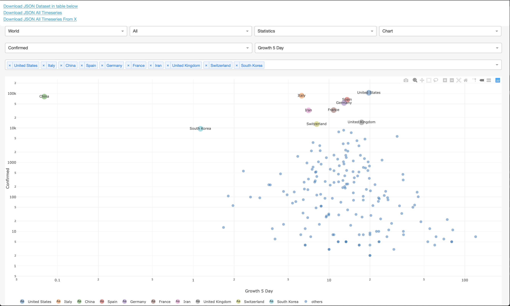
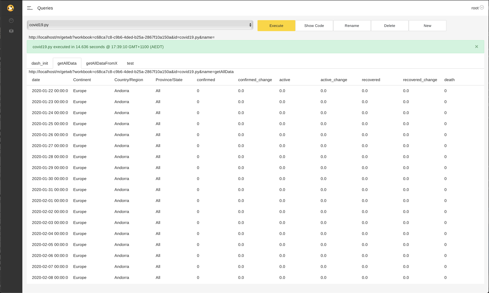

# CoFlows COVID19

This Python project offers a set of WebAPI's with an up-to-date dataset of the COVID19 virus infections. Furthermore, we have developed a quick and dirty Plotly/Dash interface to view the dataset. Using the [**CoFlows CE (Community Edition)**](https://github.com/QuantApp/CoFlows-CE) engine, the project automates a Data Pipeline that:
* Scrapes data from [ncov2019.live](https://ncov2019.live/data) for near realtime up-to-date data
* Pulls country data and history from [ULKLC GitHub repo](https://github.com/ulklc/covid19-timeseries)
* Pulls state/province data and history from the [John Hopkins University (JHU) GitHub repo](https://github.com/CSSEGISandData/COVID-19)
* Creates a coherent **Master Table**
* Computes growth rates, 5 day rolling average growth rates and daily changes

The reason we are uniting data from these three sources is because:
* [ncov2019.live](https://ncov2019.live/data) has up-to-date data but no history and certain data points are questionable since this is an automated scraping service from multiple sources.
* [ULKLC GitHub repo](https://github.com/ulklc/covid19-timeseries) has complete country data which updates quicker than the [JHU GitHub repo](https://github.com/CSSEGISandData/COVID-19).
* [JHU GitHub repo](https://github.com/CSSEGISandData/COVID-19) appears to be the most followed but only updates daily and the naming conventions have historically been inconsistent which makes working with this dataset potentially difficult.

## Visuals
The COVID19 project has two ways of visualizing the dataset within this code base. One is through **CoFlows CE** internal UI and the second is a Plotly/Dash visual. 

| Plotly/Dash |  CoFlows UI |
:-------------------------:|:-------------------------:
  | 

Hosted sample: https://app.coflows.com/dash/c68ca7c8-c9b6-4ded-b25a-2867f10a150a/covid19.py/

## WebAPI
There are three WebAPI entry points in this project:
* Custom table showing the data presented in the Plotly/Dash visual. This table is controlled by the Plotly/Dash selections. When you change the selections, the visuals change and the parameters of the url change accordingly to download the 'active' data in a JSON format. 

https://app.coflows.com/m/getwb?workbook=c68ca7c8-c9b6-4ded-b25a-2867f10a150a&id=covid19.py&name=getJson&p[0]=World&p[1]=All&p[2]=Statistics&p[3]=Confirmed&p[4]=1

* All the Timeseries for all countries and states. 

https://app.coflows.com/m/getwb?workbook=c68ca7c8-c9b6-4ded-b25a-2867f10a150a&id=covid19.py&name=getAllData

* All the Timeseries for all countries and states reindexed from the nth day of infection.  

https://app.coflows.com/m/getwb?workbook=c68ca7c8-c9b6-4ded-b25a-2867f10a150a&id=covid19.py&name=getAllDataFromX

If you choose to run this locally please change the hostname in the URLs above to http://localhost/....
## Pipeline

In more detail, the pipeline follows the next steps:

To be clear, the **Master Table** is 

1. Create a **Master Table** from the country data in the [ULKLC GitHub repo](https://github.com/ulklc/covid19-timeseries).
2. Extract only the State/Province data from the [JHU GitHub repo](https://github.com/CSSEGISandData/COVID-19)
3. Add the continent data available in the [ULKLC GitHub repo](https://github.com/ulklc/covid19-timeseries) to the State/Province data for the sake of consistency.
4. Merge the State/Province data to the **Master Table** which at this stage only contains country data.
5. Merge the live data from [ncov2019.live](https://ncov2019.live/data) into the **Master Table**. To do this, find the last point in the time-series for each country/state and
    * If the date in that last point is today then exchange that last point to relevant value from [ncov2019.live](https://ncov2019.live/data).
    * Else add a new date row to each time-series from the [ncov2019.live](https://ncov2019.live/data).

## Stack

The code is built in Python and executed using [**CoFlows CE (Community Edition)**](https://github.com/QuantApp/CoFlows-CE) which is a polyglot runtime that simplifies the development, hosting and deployment of powerful data-centric workflows. **CoFlows** enables developers to create rich **Web-APIs** with almost **zero boiler plate** and scheduled / reactive processes through a range of languages including CoreCLR (C#, F# and VB), JVM (Java and Scala), Python and Javascript. Furthermore, functions written in any of these languages can call each other within the same process with **full interop**.

The logic in Workflows is assigned to three different types.
* [Base/data.py](Base/covid19/data.py) contains the pull, scrape and processing code.
* [Agent/scraper.py](Agent/scraper.py) is the scheduled agent that once per hour updates the dataset.
* [Queries/covid19.py](Queries/covid19.py) is the Plotly/Dash interface and delivery functions for the WebAPI. Every function defined in a query is automatically assigned a _url_ by the **CoFlows** simplifying the process of creating these endpoints.

## Running Locally and the CoFlows CLI (Command Line Interface)
The **CoFlows CLI** in order to interact with **CoFlows** through the terminal. This CLI offers almost full control over the commands within **CoFlows** to a developer to:
* Test code
* Run a local version of the container / server
* Deploy containers to Azure Container Instances
* Query code on a remote **CoFlows** container.

### Running
First, to run the a local version of the server you can execute the following scripts
        unix: bin/server.sh
        win: bin/bat/server.bat

In some instances you may want to create a custom version of the quantapp_config.json setup. For example you may want to test connections of the same code to various databases. To this end you can type: 
        unix: bin/server.sh custom_quantapp_config.json
        win: bin/bat/server.bat custom_quantapp_config.json
